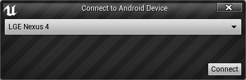
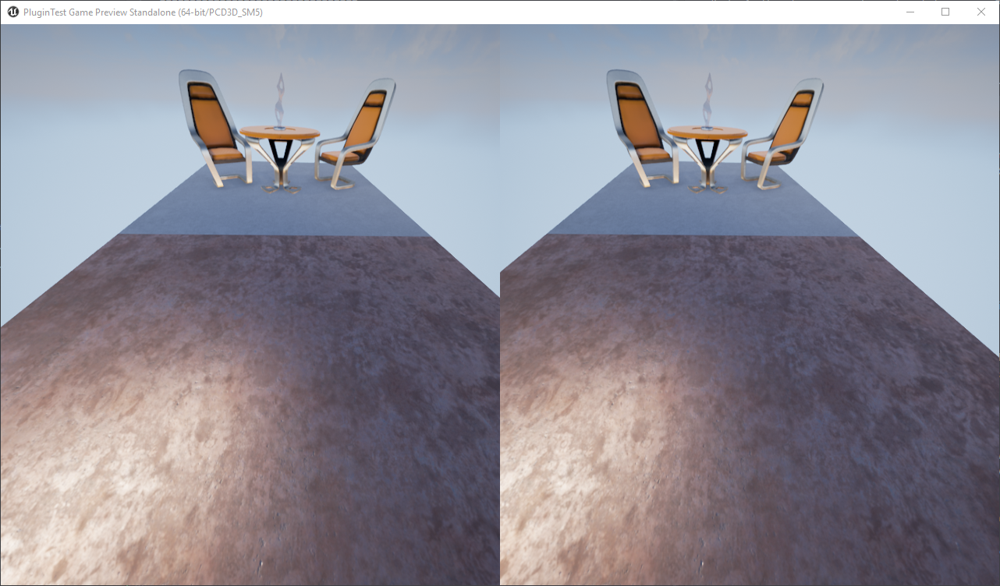
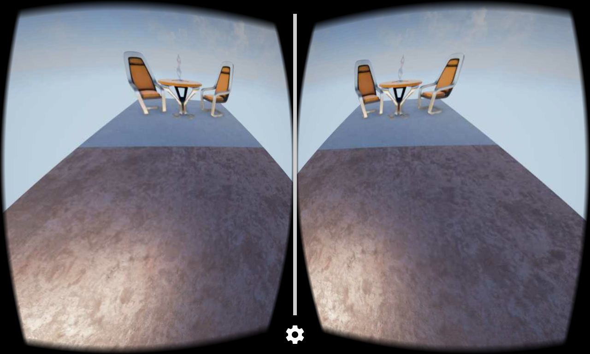

Unreal Cardboard Tethering Plugin
=================================

This plugin for UE4 allows you to use an Android device connected via USB
as a head-mounted display for Unreal content running and rendering on your
PC.

Requirements
------------
The plugin targets Unreal Engine 4.12 and Visual Studio 2015 on Windows. If you
have this setup, you can simply drop the plugin into your project's `Plugins`
folder and it should automatically compile when you reload the Unreal Editor.

This plugin will probably work on other UE4 versions with minor tweaks. It
won't work on non-Windows platforms without major tweaks to replace DirectX
specific code.

How to Use
----------
You need to install the Android app in the `Android` folder. It acts as a
receiver for VR content from the Unreal plugin.

You also need to make sure you have libusb-compatible drivers for your
Android device and for the Android Accessory Protocol virtual device.

You can obtain the correct drivers by using [Zadig](http://zadig.akeo.ie/).
To install the libusb-compatible driver for your device, simply run Zadig.
To install the drivers for the Accessory Protocol virtual device, do the
following:
1. Attempt to connect to the device using the Unreal plugin. It should appear
   in the list of devices.
2. The connection will fail. Notice that the device has switched to
   "accessory mode" and displays a permission prompt. At this point, it
   appears as an Accessory Protocol "virtual device" to your host PC.
3. Run Zadig again now that the device is in this state.
4. Disconnect and reconnect the device. The plugin connection process should
   work now.

In a future version of the plugin, the driver installation process might be
automated.

Features
--------
* Transmits head-tracking orientation and interpupillary distance.
* Streams Unreal viewport image using MJPEG compression.

Pretty Pictures!
----------------

Connection dialog:

VR preview on host machine:

Android device with Google Cardboard serving as HMD:

